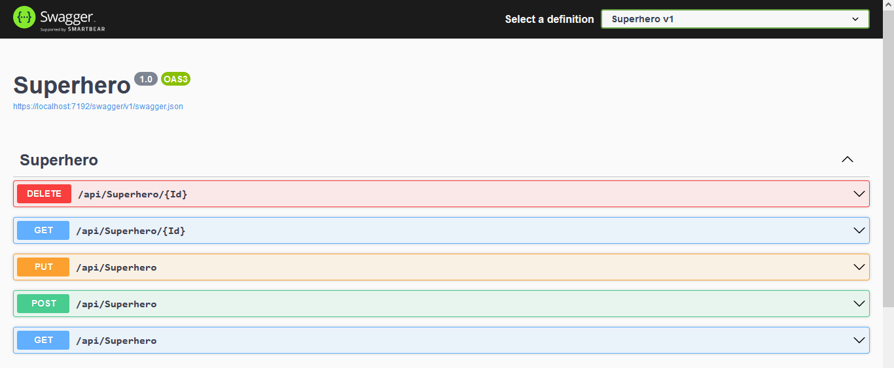

<div id="top"></div>
<!--
*** Thanks for checking out the Best-README-Template. If you have a suggestion
*** that would make this better, please fork the repo and create a pull request
*** or simply open an issue with the tag "enhancement".
*** Don't forget to give the project a star!
*** Thanks again! Now go create something AMAZING! :D
-->

<!-- PROJECT SHIELDS -->

<!--
*** I'm using markdown "reference style" links for readability.
*** Reference links are enclosed in brackets [ ] instead of parentheses ( ).
*** See the bottom of this document for the declaration of the reference variables
*** for contributors-url, forks-url, etc. This is an optional, concise syntax you may use.
*** https://www.markdownguide.org/basic-syntax/#reference-style-links
-->


<!-- PROJECT LOGO -->

<br />
<div align="center">
  <a href="https://github.com/potlitel/Superhero">
    
  </a>

<h3 align="center">Superheroes - .Net Core WebApi</h3>

<p align="center">
    project_description
    <br />
    <a href="https://github.com/potlitel/Superhero"><strong>Explore the docs »</strong></a>
    <br />
    <br />
    <a href="https://github.com/potlitel/Superhero">View Demo</a>
    ·
    <a href="https://github.com/potlitel/Superhero">Report Bug</a>
    ·
    <a href="https://github.com/potlitel/Superhero/issues">Request Feature</a>
  </p>
</div>

<!-- TABLE OF CONTENTS -->

<details>
  <summary>Table of Contents</summary>
  <ol>
    <li>
      <a href="#about-the-project">About The Project</a>
      <ul>
        <li><a href="#built-with">Built With</a></li>
      </ul>
    </li>
    <li>
      <a href="#getting-started">Getting Started</a>
      <ul>
        <li><a href="#prerequisites">Prerequisites</a></li>
        <li><a href="#installation">Installation</a></li>
      </ul>
    </li>
    <li><a href="#usage">Usage</a></li>
    <li><a href="#roadmap">Roadmap</a></li>
    <li><a href="#contributing">Contributing</a></li>
    <li><a href="#license">License</a></li>
    <li><a href="#contact">Contact</a></li>
    <li><a href="#acknowledgments">Acknowledgments</a></li>
  </ol>
</details>

<!-- ABOUT THE PROJECT -->

## About The Project



Here's a blank template to get started: To avoid retyping too much info. Do a search and replace with your text editor for the following: `github_username`, `repo_name`, `twitter_handle`, `linkedin_username`, `email_client`, `email`, `project_title`, `project_description`

<p align="right">(<a href="#top">back to top</a>)</p>

### Built With

* [Dotnet 6.0](https://dotnet.microsoft.com/en-us/download/dotnet/6.0)

<p align="right">(<a href="#top">back to top</a>)</p>

<!-- GETTING STARTED -->

## Getting Started

This repo is a rich clone of [Creating a REST Web API in C# with ASP.NET Core 5.0 and Visual Studio Code](https://luis-hernandez.medium.com/creating-a-rest-web-api-in-c-with-asp-net-core-5-0-and-visual-studio-code-809ea7b4f815). Is an step-by-step guide to show you how to create a REST Web API in C# with ASP.NET Core 5.0 and Visual Studio Code. And how test it using either Swagger or a REST Client extension..

### Prerequisites

1. First you need to check if you have installed the .NET Core 6.0 SDK with the following .NET CLI (Command-Line Interface) command:

      ```sh
      dotnet --version
      ```
    If your version is not 5 or above, [download the .NET Core 6.0 SDK](https://dotnet.microsoft.com/en-us/download/dotnet/6.0) and install it on your machine.

2. Install Visual Studio Code editor (also know as VSCode).

3. Once Visual Studio Code is open, install the REST Client extension.

4. Finally, install the C# extension to get IntelliSense features in VSCode.

### Installation

1. Clone the repo
   ```sh
   git clone https://github.com/potlitel/Superhero.git
   ```
2. Install NPM packages
   ```sh
   npm install
   ```
3. Running the project
   ```js
   dotnet watch run
   ```

<p align="right">(<a href="#top">back to top</a>)</p>

<!-- USAGE EXAMPLES -->

## Usage

Use this space to show useful examples of how a project can be used. Additional screenshots, code examples and demos work well in this space. You may also link to more resources.

_For more examples, please refer to the [Documentation](https://example.com)_

<p align="right">(<a href="#top">back to top</a>)</p>

<!-- ROADMAP -->

## Roadmap

- [ ] Feature 1
- [ ] Feature 2
- [ ] Feature 3
  - [ ] Nested Feature

See the [open issues](https://github.com/github_username/repo_name/issues) for a full list of proposed features (and known issues).

<p align="right">(<a href="#top">back to top</a>)</p>

<!-- CONTRIBUTING -->

## Contributing

Contributions are what make the open source community such an amazing place to learn, inspire, and create. Any contributions you make are **greatly appreciated**.

If you have a suggestion that would make this better, please fork the repo and create a pull request. You can also simply open an issue with the tag "enhancement".
Don't forget to give the project a star! Thanks again!

1. Fork the Project
2. Create your Feature Branch (`git checkout -b feature/AmazingFeature`)
3. Commit your Changes (`git commit -m 'Add some AmazingFeature'`)
4. Push to the Branch (`git push origin feature/AmazingFeature`)
5. Open a Pull Request

<p align="right">(<a href="#top">back to top</a>)</p>

<!-- LICENSE -->

## License

Distributed under the MIT License. See `LICENSE.txt` for more information.

<p align="right">(<a href="#top">back to top</a>)</p>

<!-- CONTACT -->

## Contact

Your Name - [@twitter_handle](https://twitter.com/potlitel) - potlitel@gmail.com

Project Link: [https://github.com/potlitel/vite-reactjs-tailwind-template](https://github.com/potlitel/vite-reactjs-tailwind-template)

<p align="right">(<a href="#top">back to top</a>)</p>

<!-- ACKNOWLEDGMENTS -->

## Acknowledgments

List of resources I find helpful and would like to give credit to. I've included a few of my favorites to kick things off!

* [Creating a REST Web API in C# with ASP.NET Core 5.0 and Visual Studio Code](https://luis-hernandez.medium.com/creating-a-rest-web-api-in-c-with-asp-net-core-5-0-and-visual-studio-code-809ea7b4f815)
* [Use with ASP.NET Core Web API](https://mysqlconnector.net/tutorials/net-core-mvc/)

<p align="right">(<a href="#top">back to top</a>)</p>

<!-- MARKDOWN LINKS & IMAGES -->

<!-- https://www.markdownguide.org/basic-syntax/#reference-style-links -->

[contributors-shield]: https://img.shields.io/github/contributors/github_username/repo_name.svg?style=for-the-badge
[contributors-url]: https://github.com/github_username/repo_name/graphs/contributors
[forks-shield]: https://img.shields.io/github/forks/github_username/repo_name.svg?style=for-the-badge
[forks-url]: https://github.com/github_username/repo_name/network/members
[stars-shield]: https://img.shields.io/github/stars/github_username/repo_name.svg?style=for-the-badge
[stars-url]: https://github.com/github_username/repo_name/stargazers
[issues-shield]: https://img.shields.io/github/issues/github_username/repo_name.svg?style=for-the-badge
[issues-url]: https://github.com/github_username/repo_name/issues
[license-shield]: https://img.shields.io/github/license/github_username/repo_name.svg?style=for-the-badge
[license-url]: https://github.com/github_username/repo_name/blob/master/LICENSE.txt
[linkedin-shield]: https://img.shields.io/badge/-LinkedIn-black.svg?style=for-the-badge&logo=linkedin&colorB=555
[linkedin-url]: https://linkedin.com/in/linkedin_username
[product-screenshot]: images/screenshot.png
